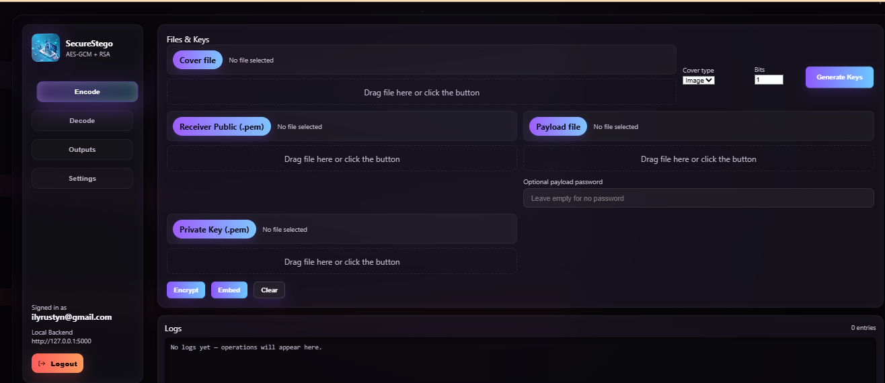
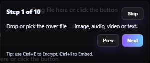
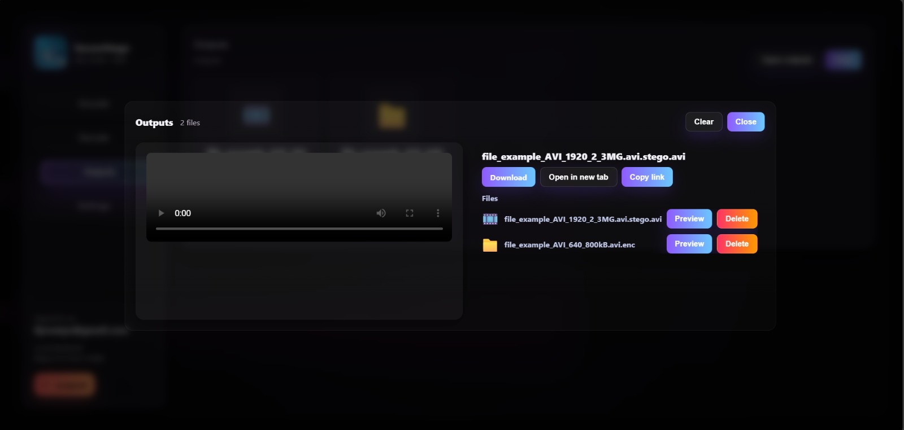
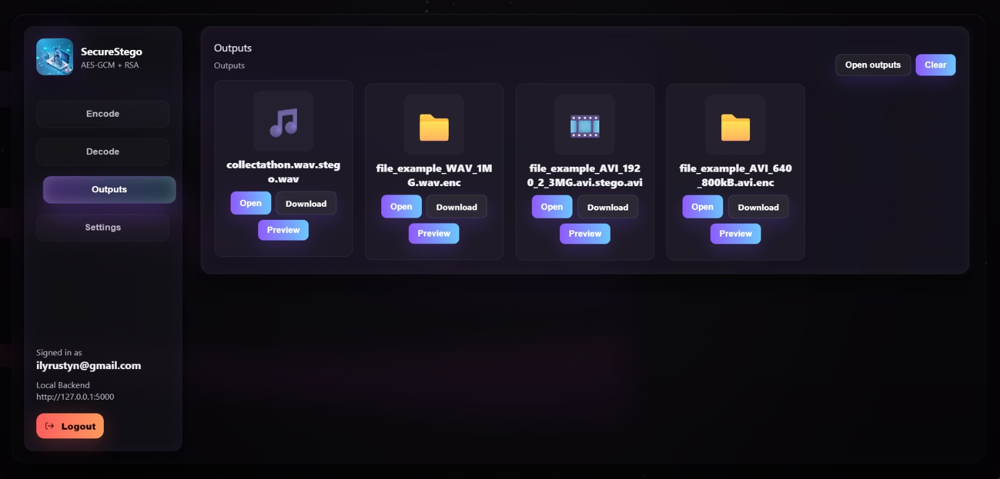
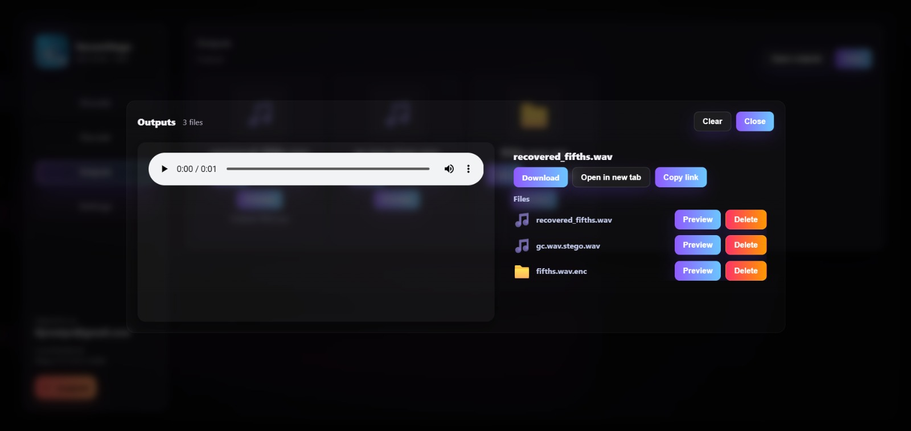

# StegoShield


## 📸 Images & Screenshots

All images and screenshots for this project should be placed in the `images/` folder at the root of the project directory.

### **Required Images:**
- `banner.png` - Project banner/header image (recommended: 1200x300px)
- `screenshot.png` - Main application screenshot (recommended: 1200x800px)
- `dashboard.png` - Dashboard interface screenshot (recommended: 1200x800px)
- `process-flow.png` - Steganography process flow diagram (recommended: 800x600px)
- `image-stego.png` - Image steganography interface screenshot (recommended: 1200x800px)
- `video-stego.png` - Video steganography interface screenshot (recommended: 1200x800px)
- `audio-stego.png` - Audio steganography interface screenshot (recommended: 1200x800px)
- `text-stego.png` - Text steganography interface screenshot (recommended: 1200x800px)

### **Available Images:**
✅ `Homepage.png` - Main application homepage
✅ `Login-page.png` - User authentication interface
✅ `Tour.png` - Application tour/overview
✅ `Encrypted-file.jpeg` - Example of encrypted file
✅ `Stego-file.jpeg` - Steganography result file
✅ `Recovered-file.jpeg` - Recovered/extracted file

### **Available Videos:**
✅ `Secure-Stego.webm` - Application demonstration video

### **Image Guidelines:**
- Use PNG format for best quality
- Maintain consistent aspect ratios
- Ensure text is readable in screenshots
- Use high-resolution images for professional appearance
- Consider using light theme for better visibility

**StegoShield: Advanced Multi-Media Steganography Suite with AES-256 Encryption and RSA Security**



## 🌟 Features

### **Multi-Media Support**
- **Image Steganography**: Hide data in JPEG, PNG, WebP, HEIC, and other image formats
- **Video Steganography**: Embed and extract secrets from video files (MP4, AVI, MOV, etc.)
- **Audio Steganography**: Conceal data in audio files (MP3, M4A, OGG, WAV, etc.)
- **Text Steganography**: Hide information within text content

### **Advanced Security**
- **RSA Encryption**: Asymmetric encryption for key exchange (2048-bit RSA)
- **AES-GCM Encryption**: Symmetric encryption for payload data (256-bit AES)
- **Digital Signatures**: RSA-based message signing and verification
- **Password Protection**: Argon2-based password hashing for additional security layer
- **JWT Authentication**: Secure user authentication with JSON Web Tokens

### **User Management**
- **User Registration & Login**: Secure user account system
- **Password Reset**: Email-based password recovery
- **Role-Based Access**: Admin and regular user roles
- **Session Management**: Secure session handling with JWT

### **Modern Web Interface**
- **React Frontend**: Modern, responsive user interface
- **Smooth Animations**: Framer Motion and GSAP for fluid UX
- **3D Background**: Three.js powered particle effects
- **Real-time Feedback**: Progress indicators and status updates




## 🏗️ Architecture

### **Backend (Python/Flask)**
```
backend/
├── app.py              # Main Flask application and API endpoints
├── auth.py             # Authentication middleware
├── auth_utils.py       # User management utilities
├── crypto_utils.py     # AES encryption/decryption helpers
├── rsa_helpers.py      # RSA encryption and digital signatures
├── stego_core.py       # Core steganography algorithms
├── stego_image.py      # Image-specific steganography
├── stego_video.py      # Video-specific steganography
├── stego_audio.py      # Audio-specific steganography
├── stego_text.py       # Text-specific steganography
├── utils.py            # File processing and utilities
├── db.py               # Database configuration
└── requirements.txt    # Python dependencies
```

### **Frontend (React)**
```
frontend/
├── src/
│   ├── App.jsx                 # Main application component
│   ├── auth/                   # Authentication components
│   │   ├── AuthContext.jsx     # Authentication context
│   │   └── ProtectedRoute.jsx  # Route protection
│   ├── components/             # Reusable UI components
│   │   ├── HexSpinner.jsx      # Loading animation
│   │   └── MeshBackground.jsx  # 3D background effect
│   ├── pages/                  # Page components
│   │   ├── Login.jsx           # Login page
│   │   ├── Signup.jsx          # Registration page
│   │   ├── Forgot.jsx          # Password reset
│   │   └── Dashboard.jsx       # Main dashboard
│   └── styles/                 # CSS and styling
├── public/                     # Static assets
└── package.json               # Node.js dependencies
```

## 🔧 Technology Stack

### **Backend Technologies**
- **Flask 2.2.5**: Web framework for REST API
- **PyCryptodome 3.19.0**: Cryptographic library
- **OpenCV 4.7.0.72**: Computer vision for image/video processing
- **NumPy 1.25.2**: Numerical computing
- **Pillow 10.0.1**: Image processing
- **SoundFile 0.12.1**: Audio file handling
- **Reed-Solomon 1.6.1**: Error correction codes
- **PyJWT**: JSON Web Token implementation
- **Werkzeug**: WSGI utilities

### **Frontend Technologies**
- **React 18.2.0**: UI framework
- **React Router 7.9.6**: Client-side routing
- **Axios 1.13.2**: HTTP client
- **Framer Motion 12.23.24**: Animation library
- **GSAP 3.13.0**: Animation library
- **Three 0.181.2**: 3D graphics
- **tsparticles 3.9.1**: Particle effects

### **External Dependencies**
- **FFmpeg**: Media file conversion and processing
- **Argon2**: Password hashing algorithm

## 🚀 Installation & Setup

### **Prerequisites**
- Python 3.8+
- Node.js 16+
- FFmpeg (for media processing)
- Git

### **Backend Setup**

1. **Clone the repository**
```bash
git clone <repository-url>
cd STEGNOGRAPHY/STEGNOGRAPHY
```

2. **Create Python virtual environment**
```bash
cd backend
python -m venv venv
.\venv\Scripts\Activate.ps1
# On Windows
venv\Scripts\activate
# On Unix/MacOS
source venv/bin/activate
```

3. **Install Python dependencies**
```bash
pip install -r requirements.txt
```

4. **Install FFmpeg**
- **Windows**: Download from [ffmpeg.org](https://ffmpeg.org/download.html) and add to PATH
- **macOS**: `brew install ffmpeg`
- **Linux**: `sudo apt install ffmpeg` or `sudo yum install ffmpeg`

5. **Create necessary directories**
```bash
mkdir -p uploads outputs tmp
```

6. **Start the backend server**
```bash
python app.py
```

The backend will run on `http://localhost:5000`

### **Frontend Setup**

1. **Navigate to frontend directory**
```bash
cd frontend
```

2. **Install Node.js dependencies**
```bash
npm install
```

3. **Start the development server**
```bash
npm start
```

The frontend will run on `http://localhost:3000`

## 📖 Usage Guide

### **User Registration & Authentication**


1. **Create an Account**
   - Navigate to `/signup`
   - Enter username, email, and password
   - Password must be at least 8 characters

2. **Login**
   - Navigate to `/login`
   - Enter credentials
   - Receive JWT token for session

3. **Password Reset**
   - Navigate to `/forgot`
   - Enter email address
   - Follow reset link sent to email

### **Steganography Operations**

#### **Image Steganography**

1. **Embedding Data**
   - Upload a cover image
   - Upload or enter secret data
   - Generate or upload RSA keys
   - Configure bits per channel (1-4)
   - Click "Embed" to create stego image

2. **Extracting Data**
   - Upload stego image
   - Provide private RSA key
   - Click "Extract" to retrieve hidden data

#### **Video Steganography**

1. **Embedding Data**
   - Upload cover video
   - Upload secret data
   - Provide RSA public key
   - Configure embedding parameters
   - Process video to create stego file

2. **Extracting Data**
   - Upload stego video
   - Provide RSA private key
   - Extract hidden payload

#### **Audio Steganography**

1. **Embedding Data**
   - Upload cover audio file
   - Upload secret data
   - Configure audio-specific parameters
   - Generate stego audio

2. **Extracting Data**
   - Upload stego audio
   - Provide decryption keys
   - Retrieve hidden data

#### **Text Steganography**

1. **Embedding Data**
   - Enter cover text
   - Upload secret data
   - Apply text steganography algorithm
   - Generate stego text

2. **Extracting Data**
   - Input stego text
   - Provide decryption keys
   - Extract hidden message

## 🔐 Security Features

### **Encryption Layers**
1. **Payload Encryption**: AES-256 GCM mode for secret data
2. **Key Encryption**: RSA-2048 for AES key protection
3. **Digital Signatures**: RSA-based message authentication
4. **Password Protection**: Argon2 hashing for user passwords

### **Steganographic Techniques**
1. **LSB Steganography**: Least Significant Bit embedding
2. **Randomized Embedding**: SHA-256 based position generation
3. **Error Correction**: Reed-Solomon codes for data integrity
4. **Multi-channel Embedding**: RGB channel utilization

### **Authentication & Authorization**
1. **JWT Tokens**: Secure session management
2. **Role-based Access**: Admin and user permissions
3. **Password Reset**: Secure email-based recovery
4. **Input Validation**: Comprehensive data sanitization

## 🔧 API Endpoints

### **Authentication**
- `POST /auth/register` - User registration
- `POST /auth/login` - User login
- `POST /auth/forgot` - Password reset request
- `POST /auth/reset` - Password reset confirmation
- `GET /auth/verify` - Token verification

### **Steganography**
- `POST /stego/image/embed` - Embed data in image
- `POST /stego/image/extract` - Extract data from image
- `POST /stego/video/embed` - Embed data in video
- `POST /stego/video/extract` - Extract data from video
- `POST /stego/audio/embed` - Embed data in audio
- `POST /stego/audio/extract` - Extract data from audio
- `POST /stego/text/embed` - Embed data in text
- `POST /stego/text/extract` - Extract data from text

### **Key Management**
- `POST /crypto/generate-keys` - Generate RSA key pair
- `POST /crypto/sign` - Sign message with private key
- `POST /crypto/verify` - Verify signature with public key

### **File Operations**
- `POST /upload` - Upload file
- `GET /download/<filename>` - Download file
- `DELETE /file/<filename>` - Delete file

## 🧪 Testing

### **Unit Tests**
```bash
# Test cryptographic functions
python test_crypto.py

# Test steganography algorithms
python test_stego.py

# Test authentication
python test_auth.py
```

### **Integration Tests**
```bash
# Test full embedding/extraction workflow
python test_integration.py

# Test API endpoints
python test_api.py
```

### **Performance Tests**
```bash
# Test with large files
python test_performance.py

# Test capacity limits
python test_capacity.py
```

## 📊 Performance Metrics

### **Supported File Sizes**
- **Images**: Up to 50MB
- **Videos**: Up to 500MB
- **Audio**: Up to 100MB
- **Text**: Up to 1MB

### **Embedding Capacity**
- **Images**: ~3% of file size (1-4 bits per channel)
- **Videos**: ~2% of file size (distributed across frames)
- **Audio**: ~1% of file size (LSB audio steganography)
- **Text**: Variable based on text length

### **Processing Speed**
- **Image Embedding**: ~2-5 seconds for 10MB images
- **Video Embedding**: ~30-60 seconds for 100MB videos
- **Audio Embedding**: ~5-10 seconds for 10MB audio
- **Text Embedding**: <1 second for typical text

## 🔍 Algorithm Details

### **LSB Steganography**
The application uses Least Significant Bit (LSB) steganography with configurable bits per channel (1-4 bits). Higher bit values increase capacity but may introduce detectable artifacts.

### **Randomized Position Generation**
Embedding positions are generated using SHA-256 hashing of a random seed combined with a counter, ensuring pseudo-random distribution of hidden data across the media.

### **Error Correction**
Reed-Solomon error correction codes are applied to embedded data to ensure recovery even if parts of the media are corrupted or modified.

### **Multi-layer Security**
1. Data is encrypted with AES-256 GCM
2. AES key is encrypted with RSA-2048
3. RSA-encrypted data is embedded using LSB steganography
4. Optional password layer using Argon2 hashing

## 🛠️ Configuration

### **Environment Variables**
```bash
# Backend Configuration
FLASK_ENV=development
SECRET_KEY=your-secret-key
JWT_SECRET=your-jwt-secret
UPLOAD_FOLDER=uploads
OUTPUT_FOLDER=outputs
TEMP_FOLDER=tmp

# Email Configuration (for password reset)
SMTP_SERVER=smtp.gmail.com
SMTP_PORT=587
SMTP_USERNAME=your-email@gmail.com
SMTP_PASSWORD=your-app-password

# Frontend Configuration
REACT_APP_API_URL=http://localhost:5000
REACT_APP_MAX_FILE_SIZE=50000000
```

### **Security Settings**
```python
# RSA Key Size
RSA_KEY_SIZE = 2048

# AES Key Size
AES_KEY_SIZE = 32

# Bits per channel limits
MIN_BITS_PER_CHANNEL = 1
MAX_BITS_PER_CHANNEL = 4

# Maximum file sizes (bytes)
MAX_IMAGE_SIZE = 50 * 1024 * 1024  # 50MB
MAX_VIDEO_SIZE = 500 * 1024 * 1024  # 500MB
MAX_AUDIO_SIZE = 100 * 1024 * 1024  # 100MB
MAX_TEXT_SIZE = 1024 * 1024         # 1MB
```

## 🐛 Troubleshooting

### **Common Issues**

1. **FFmpeg not found**
   - Ensure FFmpeg is installed and in system PATH
   - Verify installation with `ffmpeg -version`

2. **Large file processing fails**
   - Check available disk space
   - Increase timeout settings in Flask
   - Verify file size limits

3. **CORS errors**
   - Ensure Flask-CORS is properly configured
   - Check frontend API URL settings

4. **Authentication failures**
   - Verify JWT secret key consistency
   - Check token expiration settings
   - Ensure proper password hashing

5. **Steganography detection**
   - Lower bits per channel value
   - Use larger cover media
   - Apply additional preprocessing

### **Debug Mode**
Enable debug logging:
```bash
export FLASK_ENV=development
export FLASK_DEBUG=1
python app.py
```

### **Log Files**
Check application logs:
```bash
tail -f logs/app.log
tail -f logs/error.log
```

## 🤝 Contributing

1. Fork the repository
2. Create a feature branch (`git checkout -b feature/amazing-feature`)
3. Commit your changes (`git commit -m 'Add amazing feature'`)
4. Push to the branch (`git push origin feature/amazing-feature`)
5. Open a Pull Request

### **Code Style**
- Python: Follow PEP 8 guidelines
- JavaScript: Use ESLint configuration
- Comment complex algorithms
- Add unit tests for new features

## 📝 License

This project is licensed under the MIT License - see the [LICENSE](LICENSE) file for details.

## ⚠️ Legal & Ethical Considerations

This steganography tool is intended for:
- Educational purposes and research
- Legitimate data protection needs
- Privacy and security applications

**Users are responsible for:**
- Complying with local laws and regulations
- Using the tool ethically and responsibly
- Not using for illegal activities

## 🙏 Acknowledgments

- **PyCryptodome**: Cryptographic functions
- **OpenCV**: Image and video processing
- **React**: Frontend framework
- **FFmpeg**: Media processing
- **Three.js**: 3D graphics and animations

## 📞 Contact

**Developer: Shivaraj N Kengannavar**

- **Email**: shivarajnkengannavar@example.com
- **Portfolio**: https://shivarajnkengannavar-portfolio.vercel.app/
- **LinkedIn**: https://www.linkedin.com/in/shivarajkengannavar/
- **GitHub**: https://github.com/ShivarajNKengannavar

For support and questions:
- Create an issue on GitHub
- Check the troubleshooting section
- Review the API documentation
- Contact directly via email or LinkedIn

---

**Built with ❤️ for secure communication and data protection**
